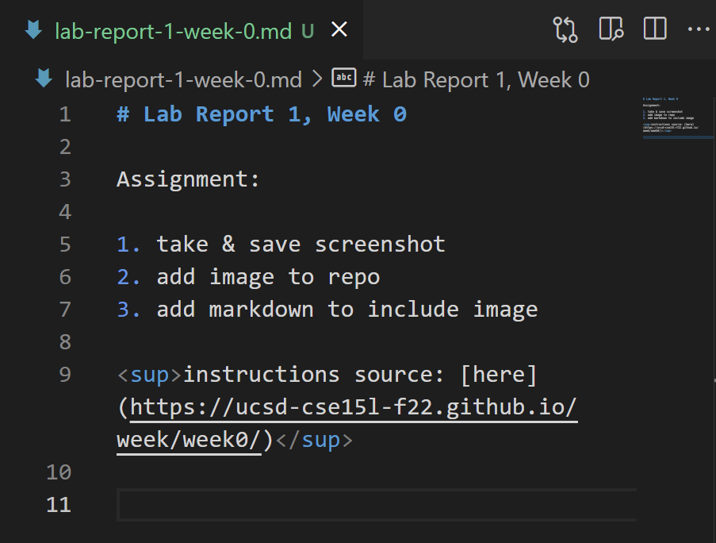

# Lab Report 1, Week 0

Assignment: 

1. take & save screenshot
2. add image to repo
3. add markdown to include image

instructions source: [here](https://ucsd-cse15l-f22.github.io/week/week0/)

---

My work:

1. took a screenshot of my work on this page in VSCode 
2. added image to file directory
3. image is below!

